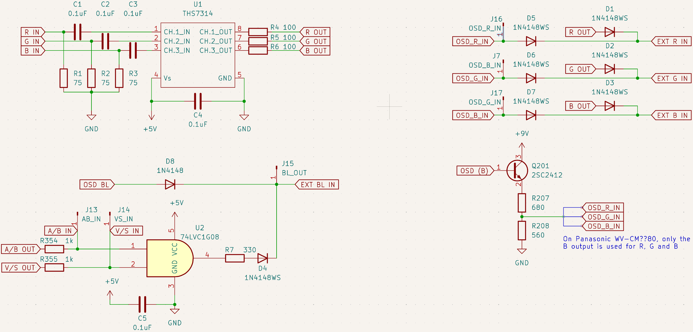
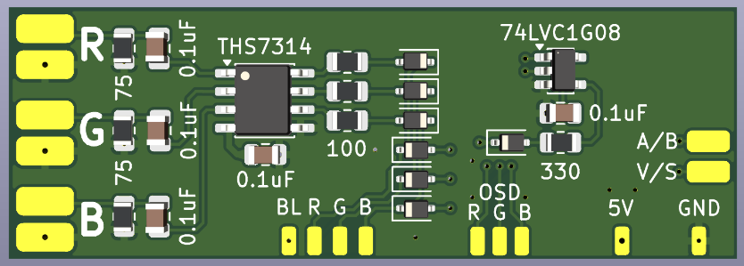
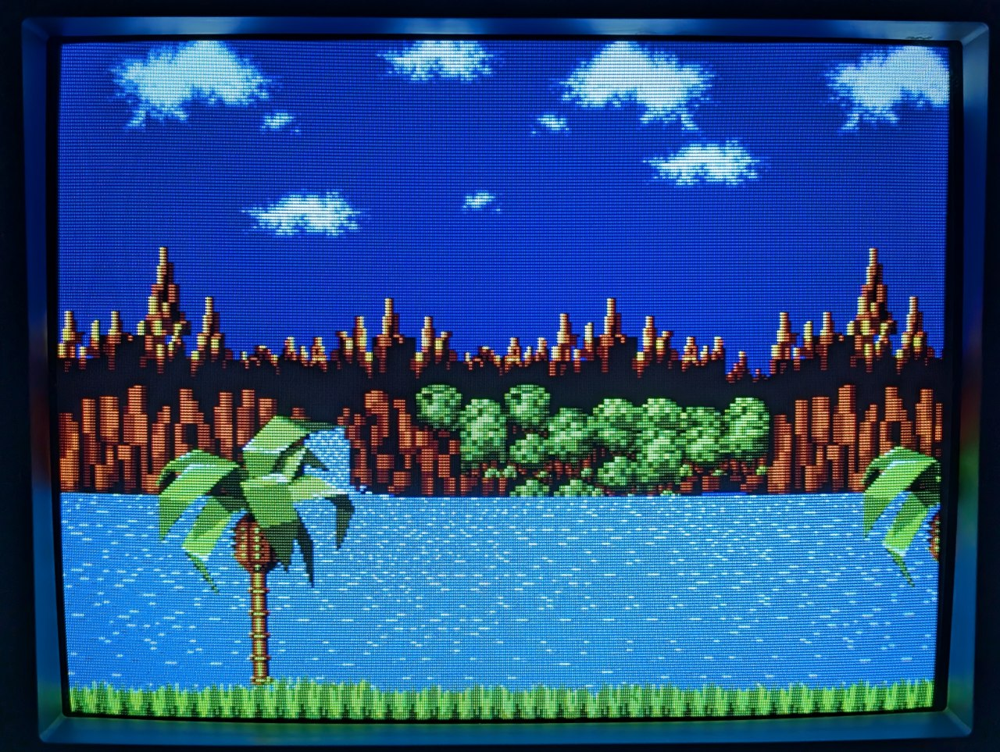

# Panasonic WV-CM1480/1780/2080 RGB Mux

The TV only has two composite inputs and one S-Video input, but can be relatively easily modded for RGB while keeping the other two inputs functional.

The regular RGB mux method cannot be used on these TVs because
- The AN5192K jungle IC doesn’t have dedicated RGB inputs and expects a non-standard input signal up to 2.5V on its OSD RGB lines
- The OSD input uses a single microprocessor output (OSD B out) that's wired to all three RGB inputs (R, G, B) via a buffer transistor

Thus, to add RGB to these TVs, we'll have to amplify the signal to get it to the levels the jungle expects.  
The schematics for WV-CM??80 and other TVs using this jungle ICs suggest that the maximum RGB input level should be somewhere in the 1.4-1.5V range, judging by the voltage divider resistor values used, also confirmed with an oscilloscope.

To amplify the input, we can use THS7314 6 dB 3-channel amplifier.  
It adds a 145 mV shift to the input signal, so the resulting output levels should be somewhere in the ~0.3-1.7V range.  
THS7315 would probably a better choice as it produces ~5V output signal for a 0.7Vp-p input signal (easily divided to the required level), but THS7314 is what I had at hand and seems to work pretty well.

## Installation

The [PCB](pcb/) is designed to be placed on top of AN5192K, with BL, R, G, B, 5V and GND positions matching the actual AN5192K pins to make installation easier.  
It also includes diodes D5-D7 on board, making the installation cleaner.

- Big RGB pads — RGB inputs (bottom pad of each pair is GND)
- BL — blanking output (AN5192K pin 10)
- R — R output (AN5192K pin 11)
- G — G output (AN5192K pin 12)
- B — B output (AN5192K pin 13)
- OSD R — microprocessor OSD input (AN5192K pin 11)
- OSD G — microprocessor OSD input (AN5192K pin 12)
- OSD B — microprocessor OSD input (AN5192K pin 13)
- 5V — 5V (AN5192K pin 23)
- GND — GND (AN5192K pin 26)
- A/B — microprocessor A/B input (R354)
- V/S — microprocessor V/S input (R355)

On WV-CM??80, OSD R, G and B can be bridged together as only the blue output of the microprocessor is used to draw the OSD.

Pictures of the tested installation based on a prototyping PCB are provided [here](pics/).

### The modifications required to the CRT

- Replace the jumper link [J378](pics/j378.jpg) with a 1N4148 diode (D8) to prevent backfeeding our blanking output into the microprocessor.  
  The voltage drop introduced by the 1N4148 diode is negligible as the minimum voltage level AN5192K requires for enabling the RGB input is 1.8V
- [Disconnect](pics/rgb2.jpg) AN5192K pins 11, 12 and 13 from the circuit by desoldering or cutting the chip legs.  
  Add 1N4148 diodes (D5-D7) between each of the pins and OSD output to prevent backfeeding our amplified signals into the original circuit.
- Replace [R208](pics/r208.jpg) (330 Ohm) resistor with a 560 Ohm resistor to compensate for the voltage drop.

### Amplifier

The amplifier circuit is fairly simple and consists of:
- 75 Ohm termination resistors (R1-R3) between RGB input and ground
- 0.1uF capacitors (C1-C3) between RGB inputs and THS7314 inputs to decouple the input
- 100 Ohm resistors (R4-R6) between THS7314 outputs and 1N1418 diodes to limit the output current
- 1N1418 diodes (D1-D3) for each of the three output channels to protect THS7314 outputs from microprocessor output

The voltage drop introduced by the 1N1418 diodes ensures that the RGB inputs receive ~1.2-1.4V, keeping the OSD visible.

### Blanking

Thankfully, Panasonic has used two microprocessor 5V outputs called A/B and V/S to directly control the input switches.  
Thus, we can simply use an AND gate to apply blanking only when the video input A is selected, keeping S-Video and the other composite input functional.

The gate inputs should be connected to A/B and V/S outputs of the microprocessor, after the 1k Ohm resistors [R354 and R355](pics/r354.jpg).  
The gate output should be connected to the jungle IC pin 10 via a current-limiting 330 Ohm resistor (R7) and a 1N4148 diode (D4) to protect the gate output from the microprocessor output.

## Results

